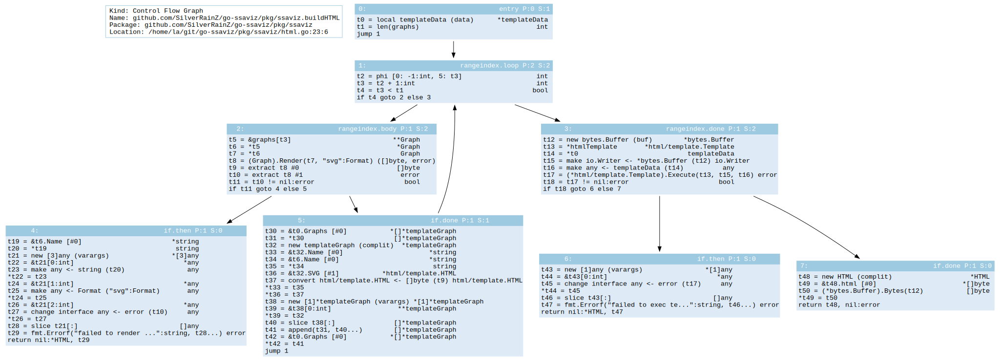

# go-ssaviz



Visualize Go SSA function using Graphviz.

## Introduction

This tool provides a visual overview of Go SSA function using Graphviz. This is especially useful in SSA-based static analysis.

## Features

- [x] Visualize [Control-flow Graph (CFG)](https://en.wikipedia.org/wiki/Control-flow_graph)
- [ ] Visualize [Dominator Tree](https://en.wikipedia.org/wiki/Dominator_(graph_theory))
- [ ] SSA instruction alignment and syntax highlight
- [ ] Drag to browse

## Requirements

- Go 1.18
- Graphviz (You should have `dot` command in your `$PATH`)

## Usage

Install go-ssaviz CLI tools:

```console
$ go install github.com/SilverRainZ/go-ssaviz@latest
```

You should make sure `GOBIN` (usually `~/go/bin`) is in your `$PATH`.
Then:

```console
$ cd path_to_your_go_package
$ go-ssaviz ./...
```

A report file `ssaviz.html` will be generated in the current directory.
See output of `go-ssaviz -help` for more details.

### Go Packages

We also provides a separated Go package:

```console
$ go get -u github.com/SilverRainZ/go-ssaviz/pkg/ssaviz
```

See [](https://pkg.go.dev/github.com/SilverRainZ/go-ssaviz/pkg/ssaviz) for more details.

## Contact

Author: [Shengyu Zhang](https://silverrainz.me)
